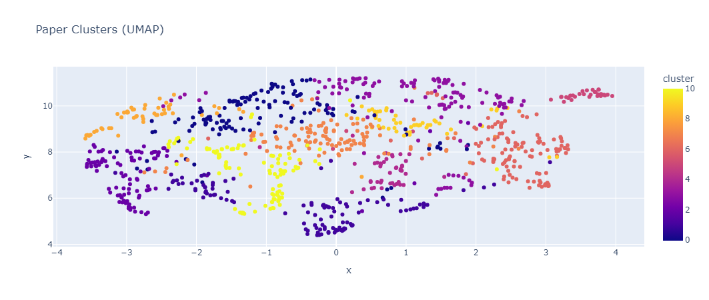

# Using graphs for clustering

## Network Analysis
- Citation Network (Paper-Paper Network)
- Co-authorship Network (Author-Author Network)
- Venue Network (Conference-Journal Network)
- Temporal Evolution of the Citation Network
<p align="center">
    
</p>

## Data Extrapolation via Clustering
### Community Detection
```markdown
Community Sizes: [1, 2, 431, 467, 277, 1, 882, 592, 6, 15, 595, 1, 3, 5, 2, 1,...
Top 10 Authors in Largest Community: ['Kai Lei', 'Fangxing Zhu', 'Cheng Peng', 'Kuai Xu', 'Hao Li', 'Xuan Guo', 'Le Chen', 'Guantao Chen', 'Yi Pan', 'Zhenzhong Chen']
```
### Naming the Communities
- Use KeyBERT for extracting keywords from each abstract/title and aggregate them together to form a single list of words as keywords for each paper. 

<table border="1" class="dataframe">
  <thead>
    <tr style="text-align: right;">
      <th></th>
      <th>Community</th>
      <th>Top_Keywords</th>
      <th>Name</th>
    </tr>
  </thead>
  <tbody>
    <tr>
      <th>0</th>
      <td>541</td>
      <td>[(3d, 0.0), (adaptive, 0.0), (agent, 0.0), (al...</td>
      <td>Service &amp; Interference</td>
    </tr>
    <tr>
      <th>1</th>
      <td>91</td>
      <td>[(3d, 0.0), (adaptive, 0.0), (agent, 0.0), (al...</td>
      <td>Interference &amp; Noise</td>
    </tr>
    <tr>
      <th>2</th>
      <td>1</td>
      <td>[(3d, 0.0), (adaptive, 0.0), (agent, 0.0), (al...</td>
      <td>Learning Research Collective</td>
    </tr>
    <tr>
      <th>3</th>
      <td>2</td>
      <td>[(3d, 0.5749793592988639), (adaptive, 0.0), (a...</td>
      <td>Testing &amp; 3D</td>
    </tr>
    <tr>
      <th>4</th>
      <td>123</td>
      <td>[(3d, 0.0), (adaptive, 0.0), (agent, 0.0), (al...</td>
      <td>Scheduling &amp; Nonlinear</td>
    </tr>
  </tbody>
</table>
</div>

### Paper-Paper Clustering via Embedding 
- Embed the abstract and title of each paper using a fitting embedding model such BERTopic or SentenceBERT, and aggregate them together. 

<p align="center">
    
</p>


